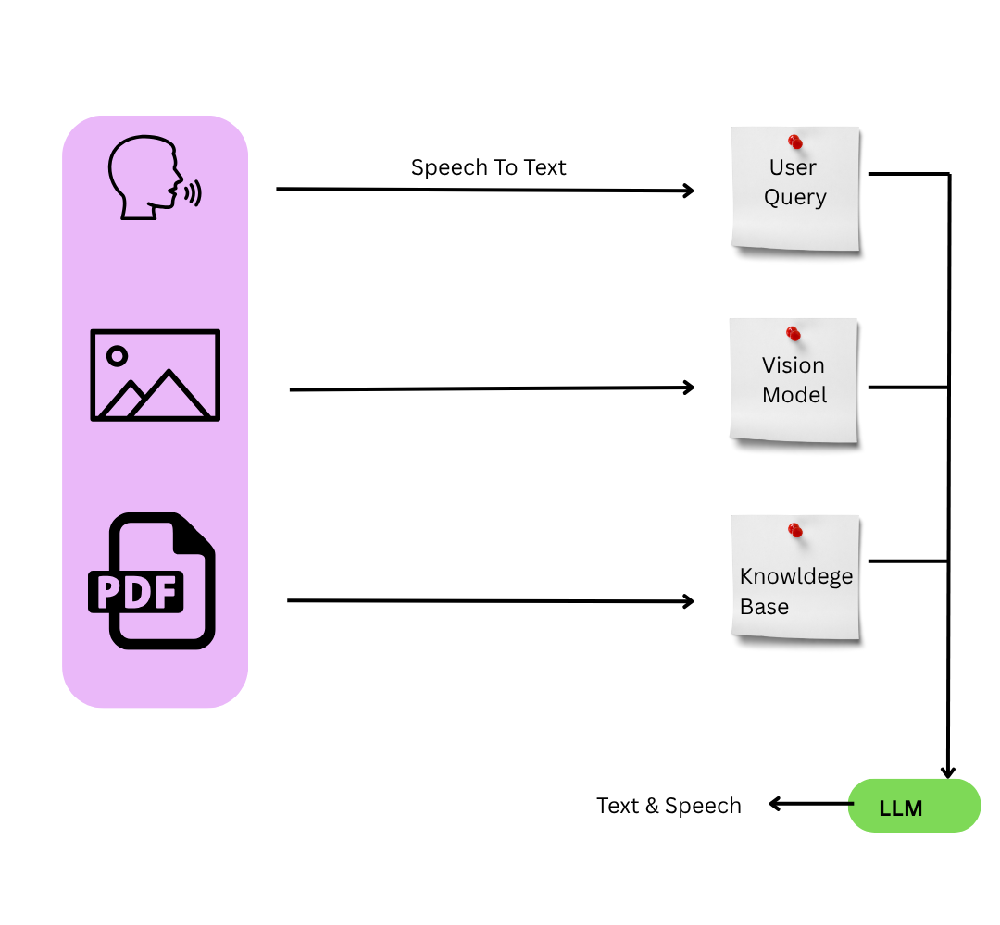

# 🧠 Contextual Super Bot

**Contextual Super Bot** is an AI-powered assistant that allows users to:
- Ask questions via text or voice
- Upload and analyze any images
- Upload any PDFs/books as knowledge bases for contextual answers
- Select from pre-uploaded knowledge base PDFs
- Get answers with context from uploaded documents and images
- Listen to answers via text-to-speech

The app uses [Gradio](https://gradio.app/) for the frontend and integrates document processing, vector search, LLMs, and speech technologies.

---

## 🚀 Features

- **Text & Voice Queries:** Ask questions by typing or recording your voice.
- **Image Analysis:** Upload any image for AI-based identification.
- **PDF/Book Upload:** Upload your own PDFs to use as a knowledge base.
- **Knowledge Base Selection:** Choose from existing PDFs for contextual answers.
- **Contextual LLM Answers:** Answers are generated using context from documents and images.
- **Text-to-Speech:** Listen to the AI’s answer with a single click.
- **Persistent Knowledge Base:** Uploaded PDFs are stored for future use.

---

## 🗂️ Project Structure

```

Contextual Super Bot/
│
├── gradio_app.py                # Main Gradio app
├── document_utility/
│   ├── document_loader.py       # Loads and parses PDF documents
│   ├── split_document.py        # Splits documents into chunks
│   └── all_pdfs.py              # Lists all PDFs in a directory
├── Utility_text_speech/
│   ├── image_identification.py  # Image analysis functions
│   ├── text_to_speech.py        # Text-to-speech utilities
│   ├── speech_to_text.py        # Speech-to-text utilities
│   └── text_to_text.py          # LLM query utilities
├── Vector_db_utility/
│   ├── vector_store.py          # FAISS vector store save/load
│   └── vector_db_query.py       # Vector search/query functions
├── Data/
│   └── PDF_Files/               # Uploaded and stored PDFs
└── requirements.txt             # Python dependencies
```

---

## ⚙️ Setup Instructions

### 1. **Clone the Repository**

```sh
git clone <your-repo-url>
cd Contextual Super Bot
```

### 2. **Create and Activate a Virtual Environment (Recommended)**

```sh
python -m venv myenv
# On Windows:
myenv\Scripts\activate
# On Mac/Linux:
source myenv/bin/activate
```

### 3. **Install Dependencies**

```sh
pip install -r requirements.txt
```

**Example `requirements.txt`:**
```
gradio
gtts
langchain
faiss-cpu
sentence-transformers
pypdf
Pillow
# Add any other dependencies your utility scripts require
```

### 4. **Download/Prepare Models**

- Make sure you have access to any required HuggingFace models (e.g., for LLM, embeddings, Whisper, etc.).
- If using HuggingFace Hub, set your API key as needed.

---

## 🖥️ Usage

### **Start the App**

```sh
python gradio_app.py
```

- The app will launch at [http://127.0.0.1:7860](http://127.0.0.1:7860)
- To share a public link, add `share=True` to `demo.launch()` in `gradio_app.py`.

---

## 🧑‍💻 How It Works

### 1. **User Interface**

- **Type your question** or **record your question** (not both).
- **Upload any image** (optional).
- **Upload any PDF/book** (optional, will be saved for future use).
- **Select a knowledge base PDF** from the dropdown (optional, uses pre-uploaded PDFs).
- **Submit** to get an answer.
- **Listen** to the answer using the speaker button.

### 2. **Backend Processing**

- **Speech-to-Text:** Converts audio queries to text.
- **Image Identification:** Analyzes uploaded images.
- **PDF Handling:** Uploaded PDFs are saved in `Data/PDF_Files/` and indexed for vector search.
- **Knowledge Base:** Select from existing PDFs for context.
- **Vector Search:** Retrieves relevant chunks from PDFs using FAISS and embeddings.
- **LLM Query:** Generates an answer using the query and retrieved context.
- **Text-to-Speech:** Converts the answer to audio for playback.

---

## 📝 Customization

- **Add More Models:** Swap out LLMs, embeddings, or image models in the utility scripts.
- **Change Data Paths:** Update `DATA_FOLDER` or vector DB paths as needed.
- **UI Tweaks:** Modify the Gradio UI in `gradio_app.py` for more/less features.
- **Add More File Types:** Allow other document/image types by editing the Gradio components.

---

## 🛠️ Troubleshooting

- **PDF Not Found in Dropdown:** Make sure PDFs are in the correct folder (`Data/PDF_Files/`).
- **Vector Store Load Error:** Ensure the vector DB for a PDF exists and paths are correct.
- **Audio/Voice Issues:** Check your browser permissions and microphone settings.
- **Model Errors:** Ensure all required models are downloaded and accessible.

---

## 🤝 Contributing

1. Fork the repo
2. Create your feature branch (`git checkout -b feature/YourFeature`)
3. Commit your changes (`git commit -am 'Add some feature'`)
4. Push to the branch (`git push origin feature/YourFeature`)
5. Create a new Pull Request

---

## 📄 License

MIT License

---

## 🙋 FAQ

**Q: Can I use my own PDFs as a knowledge base?**  
A: Yes! Upload them via the UI; they’ll be saved and available for future queries.

**Q: How do I update the knowledge base dropdown?**  
A: Refresh the app after uploading new PDFs.

**Q: Can I deploy this online?**  
A: Yes, use Gradio’s `share=True` or deploy on HuggingFace Spaces, Streamlit Cloud, or your own server.

---

**Enjoy using Contextual Super Bot!**
